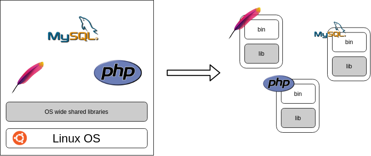
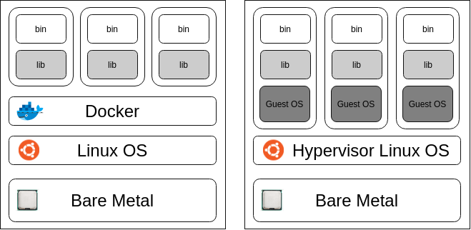
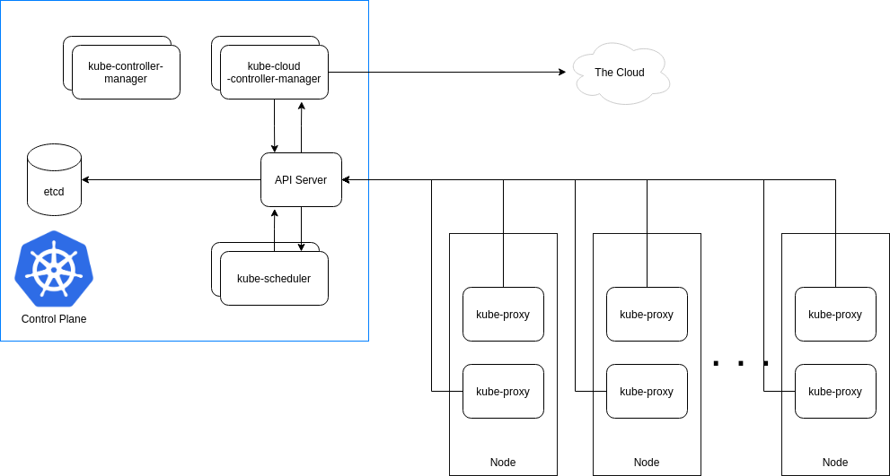

# Containers, Kubernetes, Oh my!

Notes from a container and kubernetes intro lecture.

## Quick call outs

* Hi I'm Tim. I'm an SRE, mostly Kube platforming.

* If you have a question, others might too.
  * I'm long winded. Interrupt me!
* There is no gate keeping here. Welcome!
  * Following the lecture. PLEASE reach out for any assistance.

# History

* (1950) In the beginning there were mainframes.
* (1971) Along comes UNIX a multiuser, multitasking operating system!
  * Running concurrent jobs is now much easier!
  * Time begins _for real_.
* (1991) Linux released
* (2000) FreeBSD jails
  * Environmental virtualization
  * Each jail is isolated from a security perspective
* (2003) Xen is released, the first open-source x86 hypervisor
  * AWS currently runs on top of Xen and is moving to KVM (2007)
* (2013) Docker released\*
* (2014) Kubernetes released\*
* (2015) Cloud Native Computing Foundation founded.
  * (2015) containerd, (2014) runc, kubernetes, (2012) prometheus, etc


## An example monolithic app from the 2000s

Traditional deploys often followed monolithic architecture. Or maybe just me in 2007...

LAMP stack
* Linux - The operating system it all runs on.
* Apache - The weberver to host assets
* MySQL - The database for the application
* PHP - Server side scripting language, what the client sees.

How might we deploy or operate this?
* Ubuntu linux host, tools installed locally.
  * `apt install php7.4 php7.4-mysql apache2 mariadb`
* Source code is in git
* Deployment operates by ansible - logs into the box, pulls new git main branch

What are some problems we might face with this application?
* Development environment requires a Linux host
  * Tools like vagrant exist, but that means you need to run a VM
* How do we scale components of the application?
  * If we added a cache, we bloat the system
  * To scale probably can't just duplicate the VM without duplicating the data.
* If the host goes down, we loose everything
* We might have made assumptions about how the application runs; like hardcoding the database URI
* Where are my log files?

Before we leave, let's not blame this on the individual components, and treat containers like
they solve _all_ the problems. Let's just recognize some of the characteristics of containers
that might benefit our architecture design.

----




# Containers (Docker)

What is a container?:

> An execution environment running a process, which is derived from a container image.

Ok so what's an image?

> An ordered collection of union file systems, which makes up execution parameters for a process, and includes companion binaries and libraries.

The core idea here is that:

* To run a container we must first have an image
* An image is a collection of binaries and libraries
* A container is a running instance of an image.

## Components of a Container

There are many components of docker that allow it to function. Namespaces and cgroups represent the largest kernel components but others do also exist such as IPVS. Similarly there is a bevy of userland components like; containerd, runc, and so on.

###  Namespaces

These are the bread and butter of the _how_. Namespaces allow for the process isolation and other features to work:
* `pid` - Responsible for process isolation
* `net` - manages network isolation
* `ipc` - manages inter process communication
* `mnt` - manages filesystem mounts
* `uts` - manages kernel isolation and version identifiers (derived rom Unix Time-Sharing System)
* `usr` - manages uid isolation
* `cgroup` - manages control group info from container

See the namespaces in use on a box: `lsns`. What namespaces can we see an NGINX webserver and default docker using?

```
ahab@pequod:~$ docker run -d nginx
ahab@pequod:~$ ps aux | grep nginx | head -n 1
root        6048  0.2  0.1  10648  6136 ?        Ss   03:14   0:00 nginx: master process nginx -g daemon off;
ahab@pequod:~$ sudo lsns | grep -E "6048|NS"
NS         TYPE   NPROCS   PID USER             COMMAND
4026532229 mnt         5  6048 root             nginx: master process nginx -g daemon off;
4026532230 uts         5  6048 root             nginx: master process nginx -g daemon off;
4026532231 ipc         5  6048 root             nginx: master process nginx -g daemon off;
4026532232 pid         5  6048 root             nginx: master process nginx -g daemon off;
4026532234 net         5  6048 root             nginx: master process nginx -g daemon off;
```

* Want to see the Linux system calls being used here? `man clone`

### CGroups

Cgroups or control groups provide the following:

> A Linux kernel feature that limits, accounts for, and isolates the resource usage (CPU, memory, disk I/O, network, etc.) of a collection of processes. Docker relies on cgroups to control and isolate resource limits.

### Components visualized

A few examples visualized. In these examples, rarely will you need to interact with them, but this is a useful for knowing how it functions.

#### PID

```
# On host:
ahab@pequod:~$ ps -ef --forest | grep 6026
UID          PID    PPID  C STIME TTY      STAT   TIME CMD
root        6026       1  0 03:14 ?        Sl     0:00 /usr/bin/containerd-shim-runc-v2 -namespace moby -id 8aad55e959a65ac5255e5ca3410ecd0bf6136771ed640ec1c4
root        6048    6026  0 03:14 ?        Ss     0:00  \_ nginx: master process nginx -g daemon off;
systemd+    6119    6048  0 03:14 ?        S      0:00      \_ nginx: worker process
systemd+    6120    6048  0 03:14 ?        S      0:00      \_ nginx: worker process
systemd+    6121    6048  0 03:14 ?        S      0:00      \_ nginx: worker process
systemd+    6122    6048  0 03:14 ?        S      0:00      \_ nginx: worker process
# Process is 6048 on the host
# In container:
ahab@pequod:~$ docker exec -i -t keen_grothendieck bash
root@8aad55e959a6:/# ps aux
USER         PID %CPU %MEM    VSZ   RSS TTY      STAT START   TIME COMMAND
root           1  0.0  0.1  10648  6136 ?        Ss   03:14   0:00 nginx: master process nginx -g daemon off;
nginx         33  0.0  0.0  11052  2556 ?        S    03:14   0:00 nginx: worker process
nginx         34  0.0  0.0  11052  2556 ?        S    03:14   0:00 nginx: worker process
nginx         35  0.0  0.0  11052  2556 ?        S    03:14   0:00 nginx: worker process
nginx         36  0.0  0.0  11052  2556 ?        S    03:14   0:00 nginx: worker process
root          44  0.0  0.0   3984  3344 pts/0    Ss   03:42   0:00 bash
root         385  0.0  0.0   7636  2776 pts/0    R+   03:43   0:00 ps aux
# Notice PID 1 is nginx!
```

#### MNT

Stuff has to live _somewhere_ let's look at the union file system | copy-on-write file system

```
# The container file system:
root@8aad55e959a6:/# ls /
bin  boot  dev  docker-entrypoint.d  docker-entrypoint.sh  etc  home  lib  lib64  media  mnt  opt  proc  root  run  sbin  srv  sys  tmp  usr  var
# On host:
ahab@pequod:~$ docker inspect 8aad55e959a6 | jq .[].GraphDriver
{
  "Data": {
    "LowerDir": "/var/lib/docker/overlay2/604477d283bc3c6bc1bdc21b6567a817fc330e1ac67d63ce2e333f370b697a3a-init/diff:/var/lib/docker/overlay2/6527e8f4e2435e8535ecf0eaf399abad8aced4572328ee650c61239e69beff0e/diff:/var/lib/docker/overlay2/e55e31c5ef5e08e4d25c9da0956a279cf5157125fb6d79c8a57191ae828dc356/diff:/var/lib/docker/overlay2/ae299467c2cbc0c254c9398d7386418002a68fb5c8250c8584480071d986eafe/diff:/var/lib/docker/overlay2/7939958ed4e43d29417516e32d714b548ee1c0c7d0e3b27f88d4645feac12097/diff:/var/lib/docker/overlay2/7fe7433860712100dbe08b40f51be1391ff6e376a2fa3e13505cc57617d0a40a/diff:/var/lib/docker/overlay2/4e403d8d799358056aa7be5cc1b257d0e73f3126189013348e6f8c565d52910f/diff",
    "MergedDir": "/var/lib/docker/overlay2/604477d283bc3c6bc1bdc21b6567a817fc330e1ac67d63ce2e333f370b697a3a/merged",
    "UpperDir": "/var/lib/docker/overlay2/604477d283bc3c6bc1bdc21b6567a817fc330e1ac67d63ce2e333f370b697a3a/diff",
    "WorkDir": "/var/lib/docker/overlay2/604477d283bc3c6bc1bdc21b6567a817fc330e1ac67d63ce2e333f370b697a3a/work"
  },
  "Name": "overlay2"
}
ahab@pequod:~$ ls /var/lib/docker/overlay2/604477d283bc3c6bc1bdc21b6567a817fc330e1ac67d63ce2e333f370b697a3a/merged
bin  boot  dev  docker-entrypoint.d  docker-entrypoint.sh  etc  home  lib  lib64  media  mnt  opt  proc  root  run  sbin  srv  sys  tmp  usr  var
# ^ This is the same as what's in our container! Namespaces are great!
```

#### NET

```
# On host: See the network adapters
ahab@pequod:~$ ip addr show docker0
3: docker0: <BROADCAST,MULTICAST,UP,LOWER_UP> mtu 1500 qdisc noqueue state UP group default
    link/ether 02:42:53:0b:85:09 brd ff:ff:ff:ff:ff:ff
    inet 172.17.0.1/16 brd 172.17.255.255 scope global docker0
       valid_lft forever preferred_lft forever
# In container:
root@92170144de00:/# ip addr show eth0
10: eth0@if11: <BROADCAST,MULTICAST,UP,LOWER_UP> mtu 1500 qdisc noqueue state UP group default
    link/ether 02:42:ac:11:00:03 brd ff:ff:ff:ff:ff:ff link-netnsid 0
    inet 172.17.0.3/16 brd 172.17.255.255 scope global eth0
       valid_lft forever preferred_lft forever
```

* See also `docker network ls`

## Contrast with a VM



> VM is to Virtualized Operating System as Docker is to Virtualized Process

### What components make up an Operating System?

1. Has an Init System
2. Has it's own Kernel
3.  Likely runs multiple services, e.g.
  * Networking
  * User system
  * Network time service
4. Might have a GUI or other tools for system administrators.

### What components are different in containers?

1. PID 1 in an image is always the main process NOT init!
  * Docker will let you use an init system as PID 1 but do not! The parent dockerd is responsible for managing the lifecycle of apps!
2. All containers will share the same kernel!
```
ahab@pequod:~$ uname -a
Linux pequod 5.4.0-74-generic #83-Ubuntu SMP Sat May 8 02:35:39 UTC 2021 x86_64 x86_64 x86_64 GNU/Linux
ahab@pequod:~$ docker run --rm -i -t debian uname -a
Linux 4f310e5e11de 5.4.0-74-generic #83-Ubuntu SMP Sat May 8 02:35:39 UTC 2021 x86_64 GNU/Linux
ahab@pequod:~$ docker run --rm -i -t alpine uname -a
Linux 14683a537de7 5.4.0-74-generic #83-Ubuntu SMP Sat May 8 02:35:39 UTC 2021 x86_64 Linux
```
3. containers can have child processes but should never be designed to run multiple services
4. Most tools for admins come through the dockerd API or event streams from the containers.

### How does Docker run for development and production?

* In the cloud
  * ECS and EKS run on `m5` instance types.
  * These are based on AWS' nitro system and do use dedicated hardware offloading.
* On MacOS and Windows laptops
  * MacOS Docker for Desktop creates a VM in the background. The Docker CLI tooling interacts with a docker socket running in the VM host.
  * On windows it's similar but if you have WSL2 it shares the Windows paravirtualized Linux VM

# Docker development

Let's take a break and take some consideration for how containers function.

## The CLI

The reference: https://docs.docker.com/engine/reference/run/

Get familiar with the `docker` cli.

The commands you will likely use the most are:
* `run` - Run a command in a new container.
  * `docker run mariadb` starts a mariadb container
* `exec` - Run a command in a running container
  * `docker exec -i -t 8aad55e959a6 bash` attach a tty to container instance `8aad55e959a6` with bash, useful for debugging
* `build` - Build an image from a Dockerfile
  * `docker build -t myimage:v1.0 .` builds image named `myimage` with version tag `v1.0` in the current directory
* `ps` - List containers
  * `docker ps -a` lists all containers, think of it like a combination of `ps` and `ls`
* `logs` - Fetch logs of a container
  * `docker logs 8aad55e959a6`

## Run a nginx web server

```
docker run --rm -i -t -p 80:80 nginx
```

This will spin up a webserver. `--rm` removes it when we exit. `-i` is interactive, so we can ^C to stop it. `-t` gives us a TTY. `-p 80:80` binds the container virtual IP.

Now access it

```
ahab@pequod:~$ curl localhost:80
<!DOCTYPE html>
<html>
[...]
<p><em>Thank you for using nginx.</em></p>
</body>
</html>
```

Woot!

## What about a database (And data)?

Sometimes database in docker are questionable. In many cases DB's are used for development but in production we will see docker based DBs but more commonly dedicated VMs or DB clusters.

To use a database we might want a volume. Let's consider two types of docker based volume mounts.

### Where will the data be?

Let's use the postgres docker image. We can find information about it on it's docker hub page: https://hub.docker.com/\_/postgres, it states:

> `PGDATA`
> This optional variable can be used to define another location - like a subdirectory - for the database files. The default is /var/lib/postgresql/data. If the data volume you're using is a filesystem mountpoint (like with GCE persistent disks) or remote folder that cannot be chowned to the postgres user (like some NFS mounts), Postgres initdb recommends a subdirectory be created to contain the data.

Cool we have the option to choose a path by setting the flag `-e PGDATA=/my/random/path`. But for now let's use the default and not use any envar.

This brings up an interesting point with envars. Also on the page we see:

> `POSTGRES_PASSWORD`
> This environment variable is required for you to use the PostgreSQL image. It must not be empty or undefined. This environment variable sets the superuser password for PostgreSQL. The default superuser is defined by the POSTGRES\_USER environment variable.

While at the present moment we're messing around with volumes, let's set a postgres password. The developers of this image built this in, we should use it.
### Bind mount

Much like the port associations we can use the syntax `-v /home/ahab/pgdata:/var/lib/postgresql/data`. This will create a bi directional mount from the host at path: `/home/ahab/pgdata` to inside the container `/var/lib/postgresql/data`, where our DB is saved to disk.

And so:

```
docker run -d \ 
	-v /home/ahab/pgdata:/var/lib/postgresql/data \
	-p 5432:5432 \
	-e POSTGRES_PASSWORD=sup3rSecret \
	postgres
```

A couple of things of note `-d`, detaches and moves the job to the background. `-p 5432:5432` allows our host network to reach the database, `-e POSTGRES_PASSWORD=sup3rSecret` sets a default environment variable from configuration (Note this are image/application specific, not a global standard).

### Docker volume

Images are built using COW (copy-on-write) union file systems. We can even create a union file system for storage! Let's create one

```
ahab@pequod:~$ docker volume create mydata
mydata
```

Now attach it to an instance at startup:

```
docker run -d \
	-v mydata:/var/lib/postgresql/data \
	-p 5432:5432 \
	-e POSTGRES_PASSWORD=sup3rSecret \
	postgres
```

This appears similar to the bind mount, but is stored using the docker storage driver. Benefits might include; performance, stability, and islation, you have to mount this to an image to use it. Drawbacks might be that traversal of the storage is harder.

### What if we don't do volume mounts

Containers DO NOT persist storage after they are removed unless you explicitly ask them to. Containers are often referred to as ephemeral, they will come and go frequently.

Consider the following:

```
ahab@pequod:~$ docker run --rm -i -t debian bash
root@6fecf040b851:/# touch THISFILE_WILL_IT_EXIST?
root@6fecf040b851:/# ls
'THISFILE_WILL_IT_EXIST?'   bin   boot   dev   etc   home   lib   lib64   media   mnt   opt   proc   root   run   sbin   srv   sys   tmp   usr   var
root@6fecf040b851:/# hostname
6fecf040b851
root@6fecf040b851:/# ^C
root@6fecf040b851:/# exit
ahab@pequod:~$ docker run --rm -i -t debian bash
root@e35fef900ef7:/# ls
bin  boot  dev  etc  home  lib  lib64  media  mnt  opt  proc  root  run  sbin  srv  sys  tmp  usr  var
root@e35fef900ef7:/#
root@e35fef900ef7:/# hostname
e35fef900ef7
```

Notice our file isn't in the new instance, that's because it's independnet and different. But if we did the same with a docker volume it would work.

```
ahab@pequod:~$ docker volume create exampleStorage
exampleStorage
ahab@pequod:~$ docker run --rm -i -t -v exampleStorage:/opt debian bash
root@54929cff9452:/# touch /opt/THISWILLEXIST
root@54929cff9452:/# hostname
54929cff9452
root@54929cff9452:/# ^C
root@54929cff9452:/# exit
ahab@pequod:~$ docker run --rm -i -t -v exampleStorage:/opt debian bash
root@dabbf6bdb1e7:/# hostname
dabbf6bdb1e7
root@dabbf6bdb1e7:/# ls /opt
THISWILLEXIST
root@dabbf6bdb1e7:/#
```

## Building an image

The reference: https://docs.docker.com/engine/reference/builder/

We've consume plenty of images. Let's make something!

### Recap: Union file systems

Consider the image pull process:

```
ahab@pequod:~$ docker run mariadb
Unable to find image 'mariadb:latest' locally
latest: Pulling from library/mariadb
345e3491a907: Pull complete
57671312ef6f: Pull complete
5e9250ddb7d0: Pull complete
2d512e2ff778: Extracting [==================================================>]  1.748kB/1.748kB
57c1a7dc2af9: Download complete
b846f4f4774a: Download complete
66409f940bd2: Download complete
82d8723e99d8: Download complete
55edbf0f673e: Download complete
c34793730ad6: Download complete
8f1925a0d734: Downloading [=======================>                           ]  40.79MB/86.94MB
72904fb5fd0b: Download complete
```

Notice here a series of union file systems. These are linked together from _some_ base and added along. When we run an instance of this image we inherit all of these layers as a copy, our runtime filesystem would make up a 13th layer. This will make more sense in a build context below.

### Hello world

Consider the following python app:

This is our app structure:

```
flask_helloworld/
├── app.py
├── Dockerfile
└── requirements.txt
```

#### Build it!

```
ahab@pequod:~/flask_helloworld$ docker build -t myflask .
Sending build context to Docker daemon  4.608kB
Step 1/7 : FROM python
latest: Pulling from library/python
d960726af2be: Already exists 
e8d62473a22d: Pull complete 
8962bc0fad55: Pull complete 
65d943ee54c1: Pull complete 
532f6f723709: Pull complete 
1334e0fe2851: Pull complete 
062ada600c9e: Pull complete 
aec2e3a89371: Pull complete 
1ec7c3bcb4b2: Pull complete 
Digest: sha256:e8e000f3c551f93d7b03d241e38c1206eb8c8a1f1a6179902f74e068fc98ee59
Status: Downloaded newer image for python:latest
 ---> 5b3b4504ff1f
Step 2/7 : ADD requirements.txt /
 ---> 4064901fe371
Step 3/7 : RUN pip install -r requirements.txt
 ---> Running in 24da993c8404
Collecting flask
  Downloading Flask-2.0.1-py3-none-any.whl (94 kB)
Collecting Werkzeug>=2.0
  Downloading Werkzeug-2.0.1-py3-none-any.whl (288 kB)
Collecting itsdangerous>=2.0
  Downloading itsdangerous-2.0.1-py3-none-any.whl (18 kB)
Collecting Jinja2>=3.0
  Downloading Jinja2-3.0.1-py3-none-any.whl (133 kB)
Collecting click>=7.1.2
  Downloading click-8.0.1-py3-none-any.whl (97 kB)
Collecting MarkupSafe>=2.0
  Downloading MarkupSafe-2.0.1-cp39-cp39-manylinux2010_x86_64.whl (30 kB)
Installing collected packages: MarkupSafe, Werkzeug, Jinja2, itsdangerous, click, flask
Successfully installed Jinja2-3.0.1 MarkupSafe-2.0.1 Werkzeug-2.0.1 click-8.0.1 flask-2.0.1 itsdangerous-2.0.1
WARNING: Running pip as root will break packages and permissions. You should install packages reliably by using venv: https://pip.pypa.io/warnings/venv
Removing intermediate container 24da993c8404
 ---> 156b7799251b
Step 4/7 : ADD app.py /src/
 ---> f64c6d3f1d00
Step 5/7 : WORKDIR /src
 ---> Running in 70e60f63b48d
Removing intermediate container 70e60f63b48d
 ---> 87d70166eded
Step 6/7 : ENTRYPOINT ["python"]
 ---> Running in c87aede65259
Removing intermediate container c87aede65259
 ---> 622764ca7f6d
Step 7/7 : CMD ["app.py"]
 ---> Running in ede324b6b090
Removing intermediate container ede324b6b090
 ---> 06e29f1d4c37
Successfully built 06e29f1d4c37
Successfully tagged myflask:latest
```

* Notice step 1 looks like a normal run of an image we don't have
* Entrypoints can be _anything_ in some cases like the [celrab example](https://github.com/tolson-vkn/celrab/blob/master/celery/celery/entrypoint.sh), this can even be a shell script that handles more startup.
* A statment like: `---> 87d70166eded` is a completed union file system layer. It's not a named image but you can still run an instance of it. This is very useful debug tool!

#### Run it!

```
ahab@pequod:~/flask_helloworld$ docker run --rm -i -t -p 5000:5000 myflask
 * Serving Flask app 'app' (lazy loading)
 * Environment: production
   WARNING: This is a development server. Do not use it in a production deployment.
   Use a production WSGI server instead.
 * Debug mode: off
 * Running on all addresses.
   WARNING: This is a development server. Do not use it in a production deployment.
 * Running on http://172.17.0.3:5000/ (Press CTRL+C to quit)
172.17.0.1 - - [16/Jun/2021 05:41:53] "GET / HTTP/1.1" 200 -
```

```
ahab@pequod:~$ curl localhost:5000
Hello World!ahab@pequod:~$
```

#### Recap: What's an image?

Remember images are union filesystems. They come from some base somewhere. When we pull an image from the docker hub library, or somewhere generally, we pull in a lot of layers.

But what is _the_ layer? It's called scratch. A docker image `FROM: scratch` literally just contains a namespace and cgroups. Of course, we cannot ignore that the namespace does include kernel access, but there are no user tools.

So that begs the question, when we run `docker run --rm -i -t debian bash` what is that? Debian is a Linux distribtution but we've establed containers are explicitly NOT virtual machines. What gives?

Let's track it down:
* https://hub.docker.com/_/debian?tab=description&page=1&ordering=last_updated
* Click Dockerfile link for Stable:
  * https://github.com/debuerreotype/docker-debian-artifacts/blob/259b60f4615af002995c1749c00f1abf9d9f01d8/stable/Dockerfile
```
ROM scratch
ADD rootfs.tar.xz /
CMD ["bash"]
```
* Interesting, what is rootfs.tar.zx
  * https://github.com/debuerreotype/docker-debian-artifacts/blob/259b60f4615af002995c1749c00f1abf9d9f01d8/stable/rootfs.tar.xz
* Using this let's make our own Debian!

#### Recap: Volumes for development

Earlier we demonstrated a volume mount being useful for storage of DB contents. It can also be a great help for development.

```
docker run --rm -i -t \
    -v /home/ahab/flask_helloworld:/src \
     myflask
```

Our simple flask hello world app is in debug mode. If any files change on the host side of the disk it will restart flask!

## Going faster, using docker-compose

At this point we've seen a lot of `docker` commands. Our applications have only been single container. What happens when we want to go beyond a single container? Or create an environment full of declarative and reproduceable ways to run your containers.

Enter `docker-compose`

The reference: https://docs.docker.com/compose/reference/

Here is a docker-compose file for our simple flask app:

```
version: '3'

services:
  flask:
    build: .
    container_name: flask
    hostname: flask
    ports:
      - "5000:5000"
```

Here we set our build path, what ports we want, and so forth. With that set we can do `docker-compose up` which will build or pull (if not present) and run our application.

Let's look at a bigger example: https://github.com/tolson-vkn/celrab/blob/master/docker-compose.yaml

Here is celrab, we launch 4 containers.

We mount source code for development, environment varaibles for log levels and secrets, ports to expose, and application dependency.

For a development environment this is huge. Pull the repo and simply bring up the environment.

## The Twelve Factors

Let's recap some of the interesting patterns we observed while learning docker and relate them to some tenents of microservices.

Sourced from:
* https://12factor.net/
* https://github.com/heroku/12factor (10y/o)

The Twelve Factors
1. Codebase
One codebase tracked in revision control, many deploys
2. Dependencies
Explicitly declare and isolate dependencies
3. Config
Store config in the environment
4. Backing services
Treat backing services as attached resources
5. Build, release, run
Strictly separate build and run stages
6. Processes
Execute the app as one or more stateless processes
7. Port binding
Export services via port binding
8. Concurrency
Scale out via the process model
9. Disposability
Maximize robustness with fast startup and graceful shutdown
10. Dev/prod parity
Keep development, staging, and production as similar as possible
11. Logs
Treat logs as event streams
12. Admin processes
Run admin/management tasks as one-off processes

## More Docker Examples/Tricks

* Explore images and find out how they tick by going to their page on dockerhub: https://hub.docker.com/search?q=&type=image
* Check out the celrab stack for a larger example: https://github.com/tolson-vkn/celrab
* Entrypoints can move beyond ["python"] and can come with a easy shell script extension point: https://github.com/tolson-vkn/celrab/blob/master/celery/celery/entrypoint.sh
* When developing it can be smart debugging to set an entrypoint of: `entrypoint: /bin/bash -c "while true; do sleep 10; date; done"` this makes PID 1 be a sleep loop. So it's not possible for the app to crash. Then `docker exec -i -t mycontainer <my command normal PID1>`
* Makefiles can provide a nice interface to `docker` or `docker-compose` commands: https://github.com/tolson-vkn/env-echgo/blob/main/Makefile

----

# Kubernetes

For reference: 



## How kuberentes works.

To me "It's just a scheduler" but this builds into:

> "The responsibility of the control loop is to constantly audit the desired state of the cluster to the current state of the cluster.

A variety of components help us accomplish this goal. Much of this isn't required for non SRE types but it's worth covering each component.

### API Server

> The Kubernetes API server validates and configures data for the api objects which include pods, services, replicationcontrollers, and others. The API Server services REST operations and provides the frontend to the cluster's shared state through which all other components interact.

### Kubelet

> The kubelet is the primary "node agent" that runs on each node. It can register the node with the apiserver using one of: the hostname; a flag to override the hostname; or specific logic for a cloud provider. 

### Controller Manager

> The Kubernetes controller manager is a daemon that embeds the core control loops shipped with Kubernetes. In applications of robotics and automation, a control loop is a non-terminating loop that regulates the state of the system. In Kubernetes, a controller is a control loop that watches the shared state of the cluster through the apiserver and makes changes attempting to move the current state towards the desired state. Examples of controllers that ship with Kubernetes today are the replication controller, endpoints controller, namespace controller, and serviceaccounts controller.

### Scheduler

> The Kubernetes scheduler is a control plane process which assigns Pods to Nodes. The scheduler determines which Nodes are valid placements for each Pod in the scheduling queue according to constraints and available resources. The scheduler then ranks each valid Node and binds the Pod to a suitable Node. Multiple different schedulers may be used within a cluster; kube-scheduler is the reference implementation. See scheduling for more information about scheduling and the kube-scheduler component.

### ETCD

The `/etc` daemon:

> etcd (pronounced et-see-dee) is an open source, distributed, consistent key-value store for shared configuration, service discovery, and scheduler coordination of distributed systems or clusters of machines. etcd helps to facilitate safer automatic updates, coordinates work being scheduled to hosts, and assists in the set up of overlay networking for containers. 

> As the primary datastore of Kubernetes, etcd stores and replicates all Kubernetes cluster states. Since it is a critical component of a Kubernetes cluster it is important that etcd has a reliable approach to its configuration and management.

## Navigating Kuberentes

* `kubectl` is one offical tool for kubernetes.
* `k9s` is an interactive TUI

### The kubeconfig

This yaml lives at `~/.kube/config` or somewhere in your `KUBECONFIG` path. It is used to connect you to the API server. It's used by most kubernetes tooling:

Example: 

```
apiVersion: v1
kind: Config
clusters:
- cluster:
    certificate-authority-data: <BASE64-CACERT>
    # My KVM Kube API Server endpoint
    server: https://192.168.122.4:6443
  name: kubernetes
contexts:
# You can define multiple contexts
- context:
    cluster: kubernetes
    user: kubernetes-admin
    namespace: cool-app
  name: cool-app
- context:
    cluster: kubernetes
    user: kubernetes-admin
    namespace: default
  name: default
current-context: default
preferences: {}
users:
- name: kubernetes-admin
  user:
    client-certificate-data: <BASE64-CLIENT-CERT>
    client-key-data: <BASE64-CLIENT-KEY>
```

To manage this `kubectl config get-contexts`

```
$ kubectl config get-contexts  
CURRENT   NAME       CLUSTER      AUTHINFO           NAMESPACE
          cool-app   kubernetes   kubernetes-admin   cool-app
*         default    kubernetes   kubernetes-admin   default
$ # Go work on cool app
$ kubectl config use-context cool-app
Switched to context "cool-app".
$ kubectl config get-contexts      
CURRENT   NAME       CLUSTER      AUTHINFO           NAMESPACE
*         cool-app   kubernetes   kubernetes-admin   cool-app
          default    kubernetes   kubernetes-admin   default
```

A few interesting options here:
* `kubectl get pods -n default` - list pods and optionally get a namespace
* `kubectl exec -i -t -n default env-echgo-776b8b9c64-dlpgl -- sh` - kubernetes `docker exec` style
* `kubectl api-resources` - get all of the noun resources you can access
* `kubectl port-forward service/myservice 8443:https` - listen locally on 8443 and proxy a remote service through kubectl
* `kubectl explain deployment.spec.template.spec` - example to get API spec about the Deployment spec
* `kubectl <command> --help` - great examples listed

### The power of labels

Kubernetes labels exist at the top of most manifests in the `.metadata.labels` field (and a few other places).

They can assist in querying for humans and controllers.

```
$ kubectl get pods --show-labels=true
NAME                            READY   STATUS    RESTARTS   AGE     LABELS
env-echgo-776b8b9c64-dlpgl      1/1     Running   0          16m     app=env-echgo,pod-template-hash=776b8b9c64
env-echgo-776b8b9c64-fphrj      1/1     Running   0          16m     app=env-echgo,pod-template-hash=776b8b9c64
my-service-a-75844cb448-ftjdk   1/1     Running   0          9m4s    app=my-service-a,pod-template-hash=75844cb448
my-service-a-75844cb448-gm82f   1/1     Running   0          9m4s    app=my-service-a,pod-template-hash=75844cb448
my-service-a-75844cb448-sbcm9   1/1     Running   0          9m4s    app=my-service-a,pod-template-hash=75844cb448
my-service-a-75844cb448-wwb4z   1/1     Running   0          9m4s    app=my-service-a,pod-template-hash=75844cb448
my-service-b-6b45d58984-5shx5   1/1     Running   0          8m24s   app=my-service-b,pod-template-hash=6b45d58984
my-service-b-6b45d58984-87hsd   1/1     Running   0          8m24s   app=my-service-b,pod-template-hash=6b45d58984
my-service-b-6b45d58984-xmxjn   1/1     Running   0          8m24s   app=my-service-b,pod-template-hash=6b45d58984
$ kubectl get pods -l app=my-service-b
NAME                            READY   STATUS    RESTARTS   AGE
my-service-b-6b45d58984-5shx5   1/1     Running   0          8m33s
my-service-b-6b45d58984-87hsd   1/1     Running   0          8m33s
my-service-b-6b45d58984-xmxjn   1/1     Running   0          8m33s
```

An example of a resource using labels can be found in the Deployment object. Its `.spec.selector.matchLabels` field is used to query for all pods with the defined label and then take ownership of the pod.

Service objects utilize the same mechanism to identify all pods they should route to. See services...

## Migrate our application

Let's take a quick look at the branching complexity of an app like env-echgo

It contains just the following `docker-compose`:

```
version: '3'

services:
  echgo:
    image: ghcr.io/tolson-vkn/env-echgo:latest
    container_name: env-echgo
    ports:
      - "8000:8000"
```

Becomes 65 lines of YAML files:

* https://github.com/tolson-vkn/env-echgo/blob/main/k8s/env-echgo-deploy.yaml
* https://github.com/tolson-vkn/env-echgo/blob/main/k8s/env-echgo-service.yaml

Why might this be the case?

Kubernetes is effectively a database of your entire cloud infrastructure. There are a lot of extensions and rules to conform to. This makes for a robust platform for containers. In docker-compose land, we don't have a uniform or central way to handle deployments, failover, distributed compute, and so forth.
Despite all that, fret not! Tools like `helm` and others can help reduce the complexity of kubernets manifests.

## Resources

### A group of whales is a - POD

For refernece: https://kubernetes.io/docs/concepts/workloads/pods/

In docker the smallest form of compute we had was at the process level; One instance of a container running. In Kubernetes the smallest unit of compute is a pod.

Between containers in a pod:
* They have shared networking (They share an IP)
* They have shared storage
* They are co-located and co-scheduled

Despite the ability to bundle containers to a pod, use best judgement. A webserver and database probably isn't logical. A webserver and a cache might make sense, but equal consideration could be placed on seperate cache pods.

Here is an example pod spec:

```
apiVersion: v1
kind: Pod
metadata:
  name: nginx
  labels:
    app: nginx
  namespace: default
spec:
  containers:
  - image: nginx
    imagePullPolicy: Always
    name: my-nginx
    resources:
      limits:
        cpu: "200m"
        memory: "200Mi"
      requests:
        cpu: "100m"
        memory: "100Mi"
  restartPolicy: Always
```

Generally it's not a good idea to deploy a pod by itself. This is because pod spec will run through almost every resource in Kuberentes. So if you want to deploy a service with 5 pods, you would choose a deployment, because those resources contain pod spec.

Within a deployment `kubectl explain deployment.spec.template.spec`:

> Specification of the desired behavior of the pod. More info:
> https://git.k8s.io/community/contributors/devel/sig-architecture/api-conventions.md#spec-and-status
> PodSpec is a description of a pod. 

Example: https://github.com/tolson-vkn/forge/blob/master/kubernetes/simple-manifests/deployment.yaml#L18-L30

And likewise in a Cronjob object, which is a Job resource that runs on a cron schedule, the job object contains a pod spec: `cronjob.spec.jobTemplate.spec.template.spec`

Example: https://github.com/tolson-vkn/forge/blob/master/kubernetes-apps/psql-backup/backup-cron.yaml#L24-L48

There are a lot of other great things of note:
* Init containers can run once at startup and configure part of the application
* Side cars can help provide mTLS and other functions

### Deployment

For reference: https://kubernetes.io/docs/concepts/workloads/controllers/deployment/

You describe a desired state in a Deployment, and the Deployment Controller changes the actual state to the desired state at a controlled rate. You can define Deployments to create new ReplicaSets, or to remove existing Deployments and adopt all their resources with new Deployments.

The most basic deployment from the docs:

```
apiVersion: apps/v1
kind: Deployment
metadata:
  name: nginx-deployment
  labels:
    app: nginx
spec:
  replicas: 3
  selector:
    matchLabels:
      app: nginx
  template:
    metadata:
      labels:
        app: nginx
    spec:
      containers:
      - name: nginx
        image: nginx:1.14.2
        ports:
        - containerPort: 80
```

Compared to the docker-compose.yaml, it isn't too bad. 

Consider the replicas stanza that's how we change the number of pods. When this is done and you watch the replica set you can see the "Desired state != Current state" control loop in action: Consider the mp4 `assets/video/scale.mp4`

### Service

For reference: https://kubernetes.io/docs/concepts/services-networking/service/

An abstract way to expose an application running on a set of Pods as a network service.

Here are a few types of Services:

* LoadBalancer - The most common type for external ingress. In the cloud you will get a Cloud Load Balancer assigned to the cluster.
* NodePort - Opens a port on all nodes with the same port number. Hit any node at that port and traffic will route to workloads on that node or elsewhere
* ClusterIP - Only use the predefined service network IP. This can be used for internal only traffic. To have a celery worker talk to an in-cluster message queue broker. This can take advantage of Kube service discovery like; `rabbitmq.my-namespace.svc.cluster.local`

From ealier, we can see the selector in action. We can route to two pods, and so we do:

```
$ kubectl get svc env-echgo -o wide
NAME        TYPE           CLUSTER-IP       EXTERNAL-IP      PORT(S)          AGE   SELECTOR
env-echgo   LoadBalancer   10.101.213.248   192.168.122.17   8080:30772/TCP   64d   app=env-echgo
$ kubectl get pods -l app=env-echgo
NAME                         READY   STATUS    RESTARTS   AGE
env-echgo-776b8b9c64-dlpgl   1/1     Running   0          21m
env-echgo-776b8b9c64-fphrj   1/1     Running   0          21m
$ curl -s 192.168.122.17:8080 | jq
{
  "cluster": "nonprod-us-east-1-demo",
  "message": "Hello from Ecgho Server",
  "node_name": "eli02",
  "pod_ip": "192.168.146.131",
  "pod_name": "env-echgo-776b8b9c64-fphrj"
}
$ curl -s 192.168.122.17:8080 | jq
{
  "cluster": "nonprod-us-east-1-demo",
  "message": "Hello from Ecgho Server",
  "node_name": "eli02",
  "pod_ip": "192.168.146.131",
  "pod_name": "env-echgo-776b8b9c64-fphrj"
}
$ curl -s 192.168.122.17:8080 | jq
{
  "cluster": "nonprod-us-east-1-demo",
  "message": "Hello from Ecgho Server",
  "node_name": "eli02",
  "pod_ip": "192.168.146.129",
  "pod_name": "env-echgo-776b8b9c64-dlpgl"
}
$ curl -s 192.168.122.17:8080 | jq
{
  "cluster": "nonprod-us-east-1-demo",
  "message": "Hello from Ecgho Server",
  "node_name": "eli02",
  "pod_ip": "192.168.146.129",
  "pod_name": "env-echgo-776b8b9c64-dlpgl"
}
```

### ConfigMaps

For reference: https://kubernetes.io/docs/concepts/configmap

A ConfigMap is an API object used to store non-confidential data in key-value pairs. Pods can consume ConfigMaps as environment variables, command-line arguments, or as configuration files in a volume.

This provides a nice way to get configuration into pods.

```
apiVersion: v1
kind: ConfigMap
metadata:
  name: game-demo
data:
  # property-like keys; each key maps to a simple value
  player_initial_lives: "3"
  ui_properties_file_name: "user-interface.properties"

  # file-like keys
  game.properties: |
    enemy.types=aliens,monsters
    player.maximum-lives=5
```

These can then be added to a pod spec in the following two ways:

```
apiVersion: v1
kind: Pod
metadata:
  name: configmap-demo-pod
spec:
  containers:
    - name: demo
      image: alpine
      command: ["sleep", "3600"]
      env:
        # Define the environment variable
        - name: PLAYER_INITIAL_LIVES # Notice that the case is different here
                                     # from the key name in the ConfigMap.
          valueFrom:
            configMapKeyRef:
              name: game-demo           # The ConfigMap this value comes from.
              key: player_initial_lives # The key to fetch.
        - name: UI_PROPERTIES_FILE_NAME
          valueFrom:
            configMapKeyRef:
              name: game-demo
              key: ui_properties_file_name
      volumeMounts:
      - name: config
        mountPath: "/config"
        readOnly: true
  volumes:
    # You set volumes at the Pod level, then mount them into containers inside that Pod
    - name: config
      configMap:
        # Provide the name of the ConfigMap you want to mount.
        name: game-demo
        # An array of keys from the ConfigMap to create as files
        items:
        - key: "game.properties"
          path: "game.properties"
        - key: "user-interface.properties"
          path: "user-interface.properties"
```

### Secrets

For reference: https://kubernetes.io/docs/concepts/configuration/secret/

Kubernetes Secrets let you store and manage sensitive information, such as passwords, OAuth tokens, and ssh keys. Storing confidential information in a Secret is safer and more flexible than putting it verbatim in a Pod definition or in a container image. See Secrets design document for more information.

Secrets will function in a very similar way to configmaps and environment variables in the previous example. However it's intended for more secure types of parameters.

Secrets are generally base64 encoded. As a reminder base64 is _not_ a secure hash! The reason they take on this form is to get around whitespace and other ascii problems. A docker pull config can for example be a JSON object. Base64 provides serialization not security.

```
apiVersion: v1
kind: Secret
metadata:
  name: django-secret 
  namespace: podcast
type: Opaque
data:
  secret_key: VGhlcmVJc05vU3Bvb25UaGVyZUlzTm9TcG9vbg==
```

Segmented pod spec:

```
    spec:
      initContainers:
      - image: some-podcast-django-image
        name: init-migration
        command: ["/bin/bash", "-c", "--"]
        args: ["./manage.py makemigrations; ./manage.py migrate"]
        env:
        - name: SECRET_KEY
          valueFrom:
            secretKeyRef:
              name: django-secret
              key: secret_key
```

## The landscape

Tons of open source projects and private vendor solutions for the kubernetes space. https://landscape.cncf.io/

### Helm

Helm calls itself the package manager for kuberentes.

Helm has these major functions:
* Automated deploy through `helm install`
* Template language built on Go Templates
  * Templating reoccuring values such as labels, annotations, etc.
* High level configuration through values file

Helm charts come in the following format:

```
.
└── example-helm-chart
    ├── Chart.yaml
    ├── templates
    │   ├── deployment.yaml
    │   ├── hpa.yaml
    │   ├── ingress.yaml
    │   ├── service-account.yaml
    │   ├── service.yaml
    │   └── tests
    │       └── test-http-get.yaml
    └── values.txt
```

# Links

* I have a bevy of examples for various things here: https://github.com/tolson-vkn/forge/tree/master/kubernetes
* [Docker Glossary]
* [Docker Docs]
* [Kubernetes Docs]
* [Helm Docs]

[Docker Glossary]: https://docs.docker.com/glossary/
[Docker Docs]: https://docs.docker.com
[Kubernetes Docs]: https://kubernetes.io/docs/home/
[Helm Docs]: https://helm.sh/docs/
